# Starbucks Project

## Contents
1. ScreenLayoutManagement
2. Authentication for 4 pin and 6 pin
3. Add Card

## 1. Screen layout management
1. In addition to existing patterns, __Composite__ and __Decorator__ pattern have been added to screen layout management.
    - Used pattern
        1. `Chain Of Responsibility`
            - To deliver user input to each component.
        2. `Composite`
            - To form `Screen` with several components.   
            - e.g. `PinScreen`, `TextDisplayScreen`, `KeyPad` etc
        3. `Decorator`   
        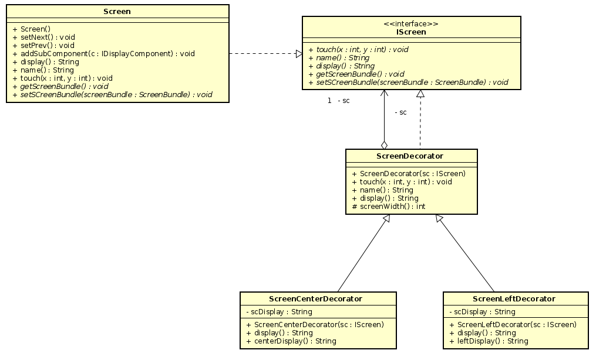   
            - To center or left-justified display.  
            - Relevant classes are `ScreenDecorator`, `ScreenCenterDecorator`, and `ScreenLeftDecorator`.  
                1. `ScreenDecorator` for defining common screen decorators.
                2. `ScreenCenterDecorator` for center-justified displaying.
                3. `ScreenLeftDecorator` for left-justified displaying.
                
2. #### ScreenLandScapeSupport   
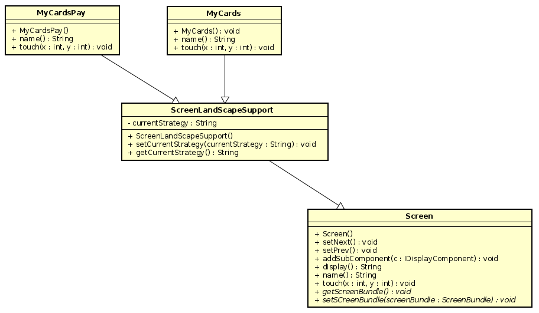   
    - To support landscape for `MyCards` and `MyCardsPay`, class `ScreenLandScapeSupport` has been added.    
    - `ScreenLandScapeSupport` inherits from `Screen` to add support features. (e.g. set/get display mode)  
    - And `MyCards`, `MyCardsPay` inherit from `ScreenLandScapeSupport`.   
    - `ScreenDecorator` checks them if portrait or landscape, and display contents accordingly   
    
3. #### ScreenBundle   
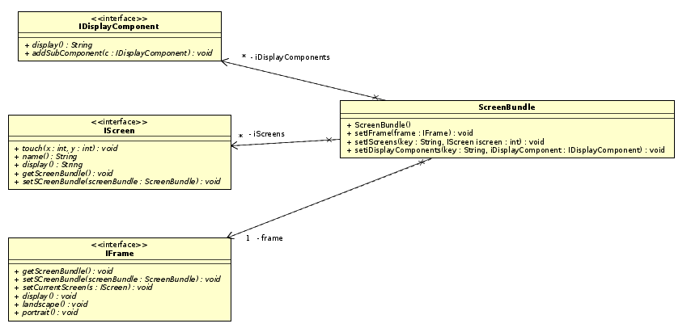   
    - class `ScreenBundle` contains several `IScreen` and `IFrame`.   
    - It provides objects to other classes, which lets them communicate without dependencies among them.   
    
4. #### TextDisplayScreen   
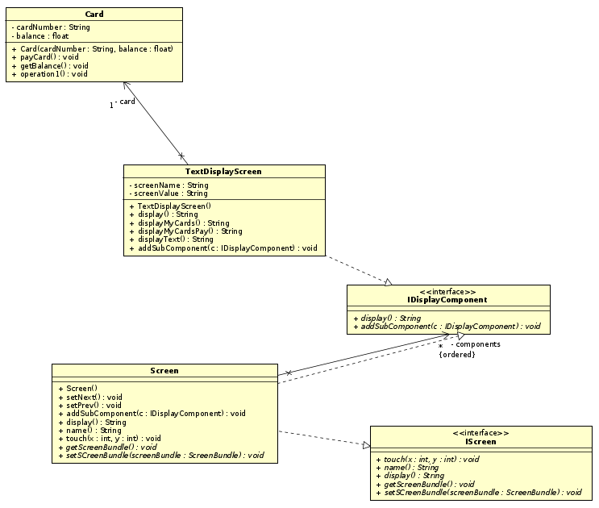   
    - Extended version of class `Spacer`.   
    - It supports not only space, but also texts, amount of balance in card.   
    - Only implements `IDisplayComponents` since it only needs to display, not touch.   
    
5. Refer to __ScreenLayoutManagement.asta__ for overall details.

## 2. Authentication for 4 pin and 6 pin   
1. #### SixDigitsPasscode   
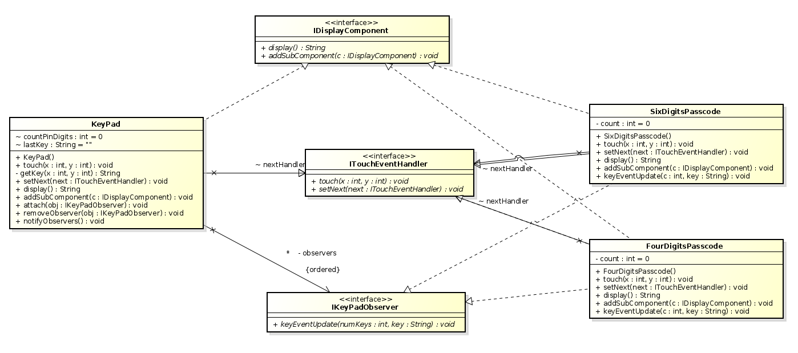   
    - For both 4pin and 6pin passcode screens, it has been decided to split `Passcode` into 4 pin and 6 pin respectively.  
    - Previous `Passcode` is now `FourDigitsPasscode`, and new `SixDigitsPasscode` has been added.   

2. #### FivePinDigits, SixPinDigits and PinEntryMachine
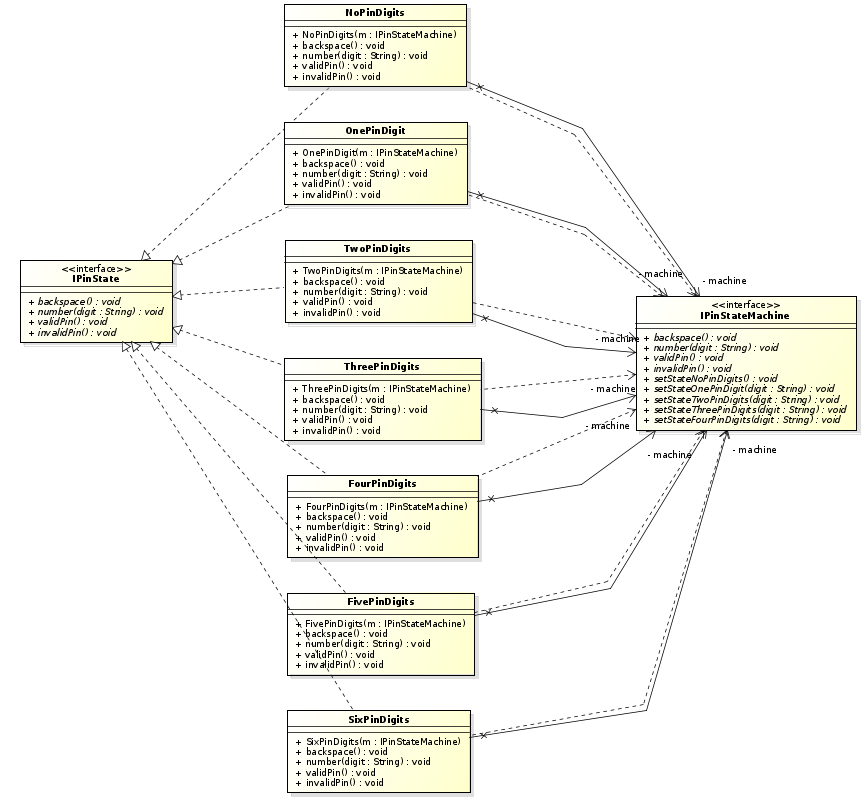
    - To represent 6 pin digits, `FivePinDigits` and `SixPinDigits` have been added.  
    - So have `PinEntryMachine` been accordingly.  

3. Refer to __4Pin6PinAuthentication.asta__ for overall details.  

## 3. Add Card
1. Overall structure is similar to PIN Authentication. It consists of __digits displays__, __key pad router__, and __spacer__. And focused __key pad__ inside __key pad router__ notifies its update to internal __EntryMachine__ and __digits display__. To represent input status, __EntryMachine__ utilizes State pattern.  
    - Key components (class)   
    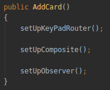   
        1. `KeyPadRouter`  
            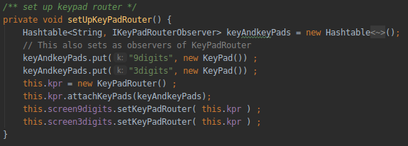
            - Contains two `KeyPad`s as a HashMap, and wraps most methods of `KeyPad`.  
                > One `KeyPad` for `NineDigitsScreen` which represents __Card Numbers__.  
                > The other `KeyPad` for `ThreeDigitsScreen` which represents __Card Codes__.  
            - It supports switching focus when proper `touch` invoked.  
            - `AddCard` screen has `KeyPadRouter` as a component, not individual `KeyPad`s.  
        2. `NineDigitsScreen` and `ThreeDigitsScreen`  
            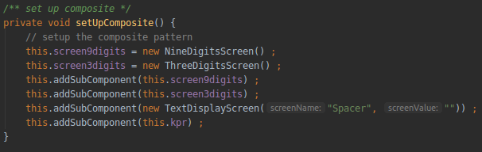
            - They display input __Card Numbers and Codes__ respectively.  
            - Each screen observes each `KeyPad` inside `KeyPadRouter`.  
        3. `NineDigitsEntryMachine` and `ThreeDigitsEntryMachine`  
            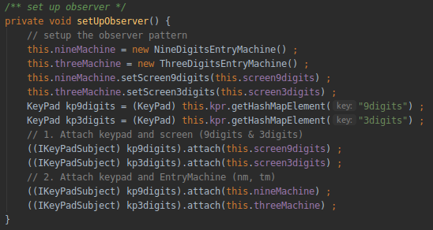
            - They store user inputs, __Card Numbers and Codes__ respectively.  
            - Each entry machine observes each `KeyPad` inside `KeyPadRouter`.  
    - Used pattern
        1. `State`  
        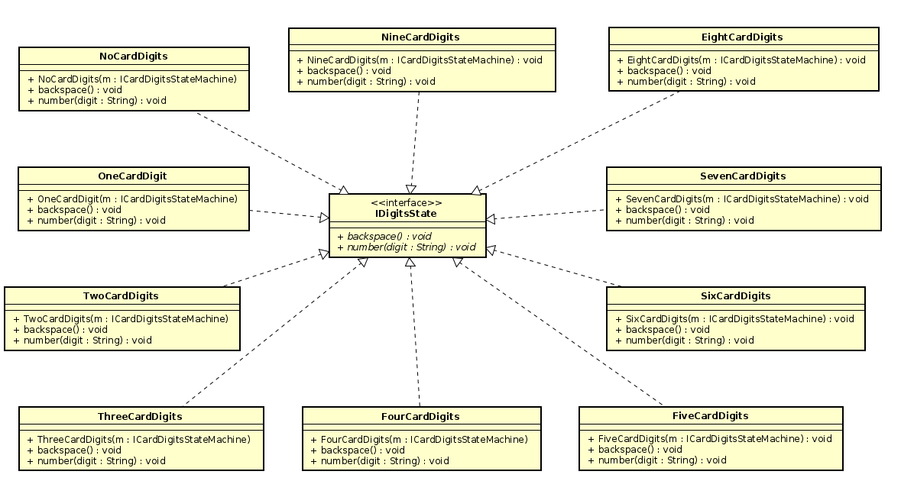
            - To represent input status of __Card Numbers and Codes__.  
            - `NineDigitsEntryMachine` and `ThreeDigitsEntryMachine` have their own current state respectively.  
            - Those machines and state pattern work same as `PinEntryMachine`.  
        2. `Observer`  
        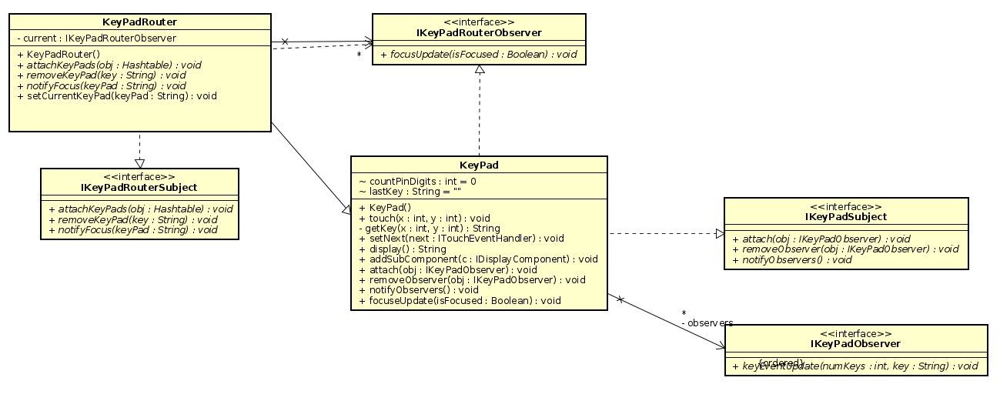
            - First `KeyPad` for __Card Numbers__.  
                > Subject (IKeyPadSubject) : KeyPad  
                > Observers (IKeyPadObserver) : `NineDigitsScreen`, `NineDigitsEntryMachine`  
            - Second `KeyPad` for __Card Codes__.  
                > Subject (IKeyPadSubject) : KeyPad  
                > Observers (IKeyPadObserver) : `ThreeDigitsScreen`, `ThreeDigitsEntryMachine`  
            - `KeyPadRouter` to notify its focus to KeyPads.  
                > Subject (IKeyPadRouterSubject) : KeyPadRouter  
                > Observers (IKeyPadRouterObserver) : Two KeyPads  
        3. `Composite`  
            - To consist `AddCard` with `Screen`s, `KeyPadRouter`, and `EntryMachine`s.  
            - Uses `addSubComponent()` of `Screen`.  
        4. `Decorator`  
            - To center-justify its display.  
            - Uses `ScreenCenterDecorator`.  
        5. `Chain of Responsibility`  
            - `AddCard` doesn't break existing COR pattern within class `Screen`.
            - Uses `chain.touch()` of `Screen`.  
            
2. Refer to __AddCard.asta__ for overall details.  